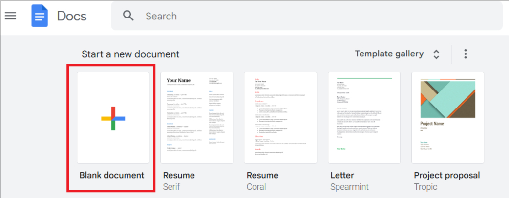
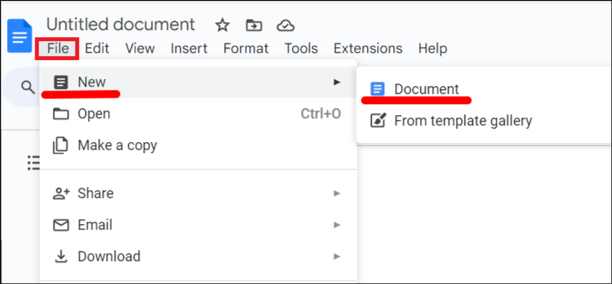
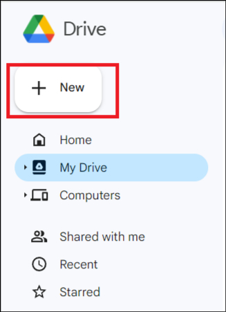
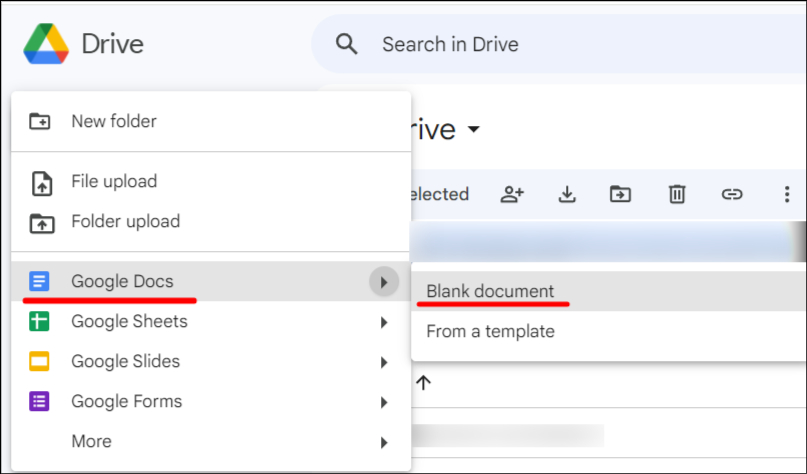

There are several ways to create a Google document. 

The easiest way to create a Google document is to:

1. Open [Google Docs.](https://docs.google.com)

1. Click **Blank document**.

    

The new document is created.

Alternatively, you can create a new Google document:

- From another Google document.
- From Google Drive.

To create a new document from another Google document:

1. Open a Google document.
1. In the **File** menu, click **New** > **Document**.

    

To create a new document from Google Drive:

1. Open [Google Drive.](http://drive.google.com/)

1. Click **New**.

    

1. Click **Google Docs** > **Blank document**.

    

The new document is created.