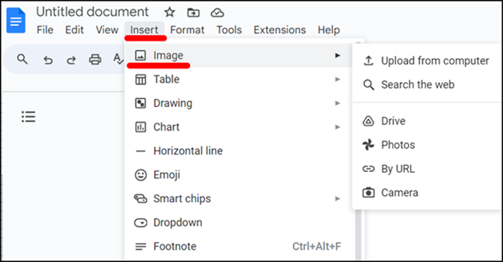
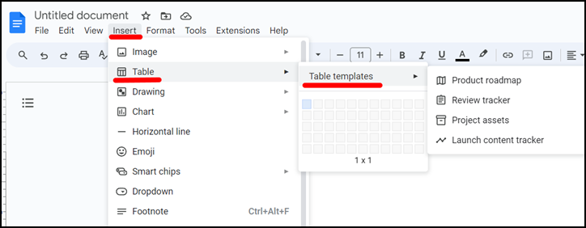
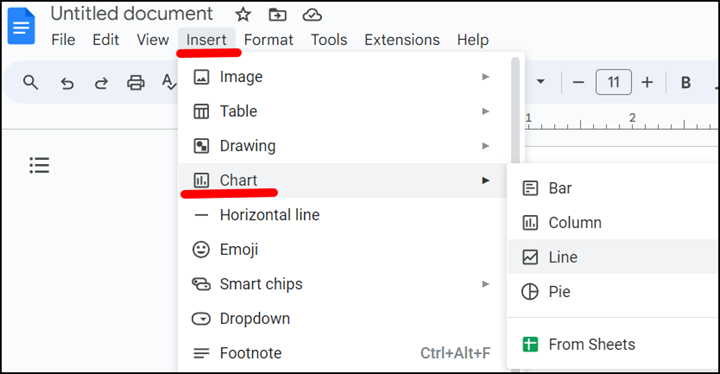
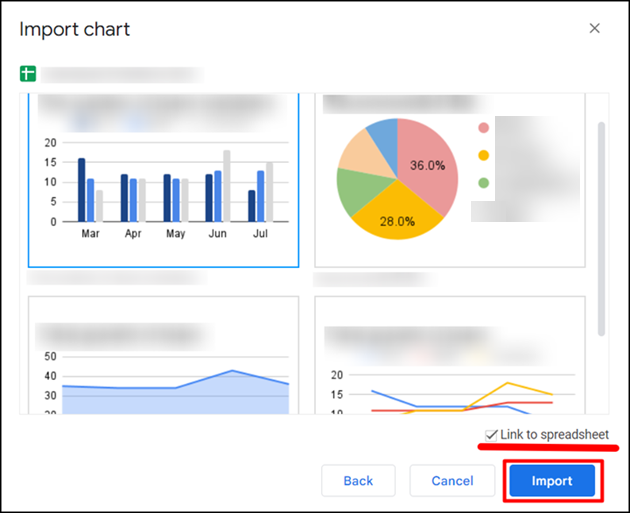

You can insert different types of content in a Google document, such as:

- [Images](#insert-images).
- [Tables](#insert-tables).
- [Charts](#insert-charts).

## Insert images

To insert an image in a Google document:

1. Open the Google document. 
2. In the **Insert** menu, click **Image**.
1. In the dropdown menu, select the source of the image:
    - **Upload from computer**.
    - **Search the web**.
    - **Drive**.
    - **Photos**.
    - **By URL**.
    - **Camera**.

      

1. Select the necessary image and click **Insert** or **Open**.

The image is inserted in your document.

## Insert tables

To insert a table in a Google document:

1. Open the Google document. 
1. In the **Insert** menu, click **Table**.
1. Set the table size or select a table template.

    - To select how many rows and columns you want to add, use a pointer.
    - To insert a table template, click **Table templates** and select the necessary template. 

    

The table is inserted in your document.

## Insert charts

To insert a chart in a Google document:

1. Open the Google document. 
1. In the **Insert** menu, click **Сhart**.

    

1. Select the type of the chart or insert the chart from Google Sheets.

    To insert the chart from Google Sheets: 

      1. In the **Chart** menu, click **From Sheets**.
      1. Select the necessary spreadsheet and click **Select**.
      1. Select the needed chart.
      1. If you want to add the link for the chart, select **Link to spreadsheet**.
      1. Click **Import**.

    
    

The chart is inserted in your document.