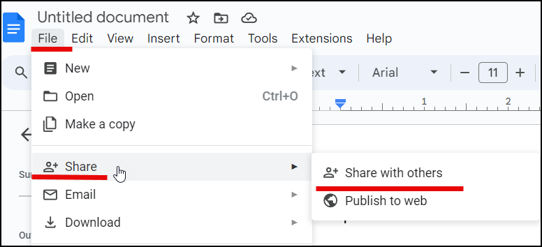
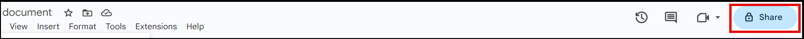
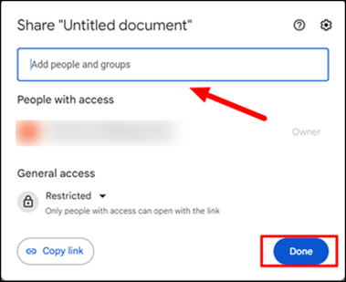
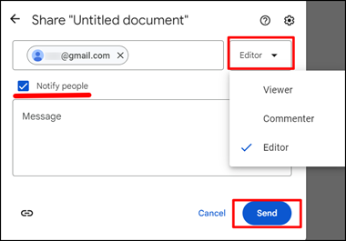
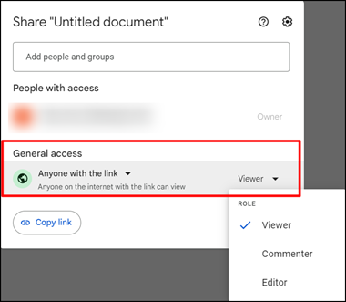
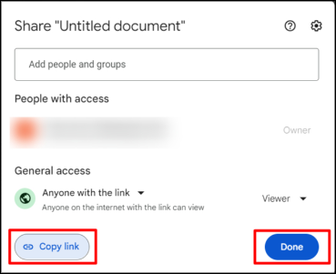
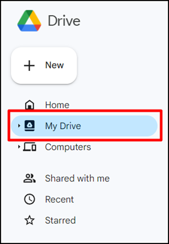
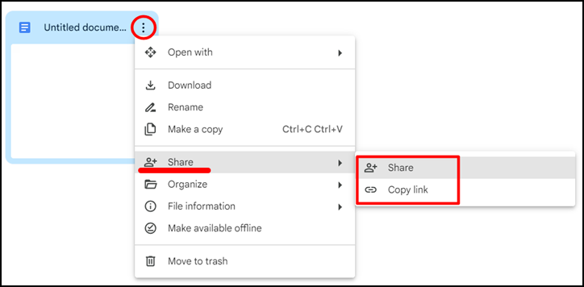

Google documents are saved in [Google Docs](https://docs.google.com/) and [Google Drive](https://drive.google.com/). You can share your documents with other users with Gmail accounts.

[How to create a Gmail account?](https://support.google.com/mail/answer/56256?hl=en)

You can share your documents with specific people or via the link. 

## Share Google documents with specific people

To share a Google document with specific people:

1. Open the Google document that you want to share.

1. In the **File** menu, click **Share** > **Share with others**.    

    

    Alternatively, click the **Share** button.

    

1. In the field, enter the Gmail addresses of people you want to share your document with.

1. Click **Done**.

    

1. Select the access level:

    - Viewer.
    - Commenter.
    - Editor.

1. Select **Notify people** and type a message if necessary.
        
1. Click **Send**.

    

## Share Google documents via the link
    
To share a document via the link:

1. Open the Google document that you want to share.

1. In the **File** menu, click **Share** > **Share with others**.    

    

    Alternatively, click the **Share** button.

    

1. In **General access**, open a drop-down list and select **Anyone with the link**.

1. Select the access level:
    - Viewer.
    - Commenter.
    - Editor.

    

1. Click **Copy link** and then click **Done**.

    

1. Send the link to people you want to share your document with.

## Share Google documents from Google Drive

You can also share your document from Google Drive.

To share a document from Google Drive:

1. Open [Google Drive](http://drive.google.com).
1. In the menu, click **My Drive**.

    

1. In the menu of the file you want to share, click **Share**.

1. Select how you want to share your document.

    - To share your document with specific people, click **Share** and repeat the steps for [sharing with specific people](#share-google-documents-with-specific-people). 
    - To share via the link, click **Copy link** and send the link to people you want to share your document with.

    