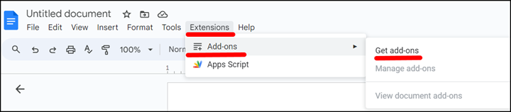
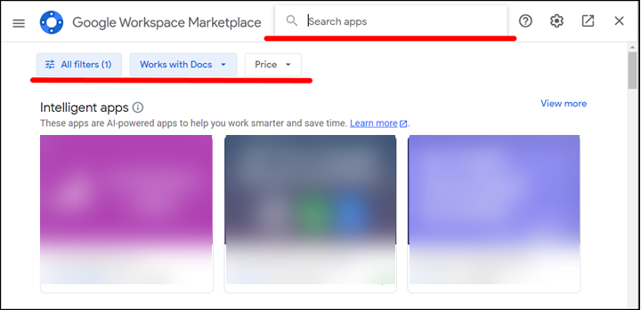
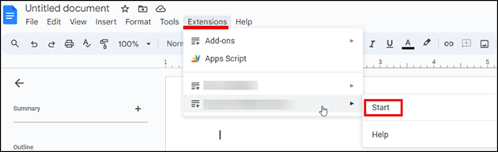
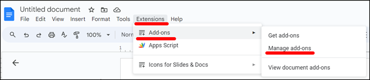

To do more with Google Docs, you can use add-ons. Some add-ons can help you create bibliographies, forms, equations, diagrams, and more. Add-ons run inside Google Docs and can be installed from Google Workspace Marketplace. 

## Install add-ons

To install an add-on :

1. Open the Google document.
1. In the **Extensions** menu, click **Add-ons** > **Get add-ons**.

    

1. In Google Workspace Marketplace, select the necessary add-on.

    ???+tip
    
        Use the **Search** field or filters to find the necessary add-on.

        

1. Click **Install**.
1. Follow the instructions to install the add-on.

The add-on is installed. 

## Start using add-ons

To start using an add-on: 

1. In the **Extensions** menu, select the add-on.
1. Click **Start**.

    

## Uninstall add-ons

To uninstall an add-on:

1. In the **Extensions** menu, click **Add-ons** > **Manage add-ons**.

    

1. Select the add-on that you want to uninstall.

1. Click **Uninstall**.
1. Confirm the uninstallation by clicking **UNINSTALL APP**.

The add-on is uninstalled.
