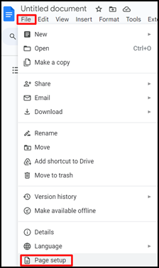
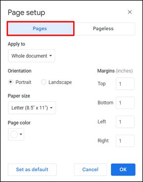
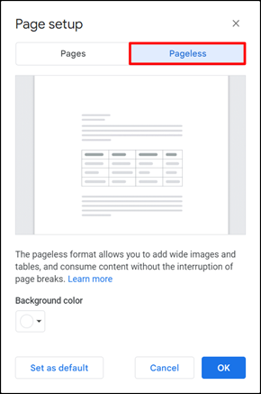

To manage page settings in a Google document:

1. Open the Google document.

1. In the **File** menu, click **Page setup**.

    

1. Select the necessary format of your document: pages or pageless.

    To select the pages format, open the **Pages** tab.

    

    To select the pageless format settings, open the **Pageless** tab.

    

4. Change the settings for the chosen format.

    For the pages format, you can set up the following page settings:

    - Application of the settings:
        - To the whole document.
        - To the selected content.
    - Orientation:
        - Portrait.
        - Landscape.
    - Paper size.
    - Margins.
    - Page color.

    For the pageless format, you can set up a background color. 

    To set up a background color, click the expanded arrow and select the suitable color.

    Optional: Click **Set as default** to apply chosen settings to any new documents you create.

5. Click **OK**.
